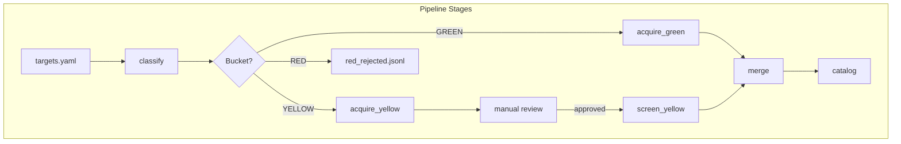

# Dataset Collector — Complete Issues & Fixes Checklist

A comprehensive numbered checklist of every issue identified in the repository, with specific instructions for resolution.

---

## 1. Version String Mismatch Across Pipeline Drivers

**Problem:** Many `*_pipeline_v2/pipeline_driver.py` files declare `VERSION = "1.0"` while others use `"2.0"`. This pollutes manifests, breaks provenance tracking, and makes the "v2 contract" ambiguous.

**Files Affected:**
- `chem_pipeline_v2/pipeline_driver.py` → `VERSION = "1.0"`
- `biology_pipeline_v2/pipeline_driver.py` → `VERSION = "1.0"`
- (and others — audit all 18 pipelines)

**Fix:**
1. Audit all `*_pipeline_v2/pipeline_driver.py` files for VERSION declarations
2. Update all to `VERSION = "2.0"` (or import from central location per Issue #2)
3. Add a CI check that greps for hardcoded VERSION strings and fails if found

```bash
# Audit command
grep -r "VERSION = " --include="*.py" */pipeline_driver.py
```

---

## 2. Centralize Version Management

**Problem:** Version strings are hardcoded in 50+ files across the repository, making coordinated updates error-prone.

**Files Affected:**
- All `pipeline_driver.py` (18 files)
- All `acquire_worker.py` (18 files)
- All `yellow_scrubber.py` (18 files)
- `collector_core/*.py` (8 files)
- Various workers and tools

**Fix:**
1. Create `collector_core/__version__.py`:
```python
__version__ = "2.0.0"
__schema_version__ = "0.9"
```

2. Update all files to import:
```python
from collector_core import __version__
VERSION = __version__.__version__
```

3. Update `pyproject.toml` to use dynamic versioning:
```toml
[project]
dynamic = ["version"]

[tool.setuptools.dynamic]
version = {attr = "collector_core.__version__.__version__"}
```

4. Add pre-commit hook or CI check to prevent hardcoded version strings

---

## 3. Extract Shared Pipeline Driver Base

**Problem:** `pipeline_driver.py` is ~37KB and nearly identical across 18 pipelines (~666KB total duplication).

**Files Affected:**
- All 18 `*_pipeline_v2/pipeline_driver.py` files

**Fix:**
1. Create `collector_core/pipeline_driver_base.py` containing:
   - `LicenseMap` dataclass and `load_license_map()`
   - `load_denylist()` and `denylist_hits()`
   - `resolve_spdx_with_confidence()`
   - `compute_effective_bucket()`
   - `fetch_license_evidence()`
   - `resolve_routing_fields()`
   - All utility functions (`utc_now`, `ensure_dir`, `sha256_bytes`, etc.)
   - `BasePipelineDriver` class with `classify()`, `main()` methods

2. Create domain-specific configs in each pipeline:
```python
# chem_pipeline_v2/pipeline_driver.py
from collector_core.pipeline_driver_base import BasePipelineDriver

class ChemPipelineDriver(BasePipelineDriver):
    DOMAIN = "chem"
    DEFAULT_ROUTING = {"subject": "chem", "domain": "misc"}
    
if __name__ == "__main__":
    ChemPipelineDriver().main()
```

3. Move domain-specific routing logic (e.g., `chem_routing`, `math_routing`) to config or subclass methods

**Estimated Reduction:** ~666KB → ~60KB (90% reduction)

---

## 4. Consolidate Duplicated `pmc_worker.py`

**Problem:** `pmc_worker.py` (~16KB) is replicated across 15+ pipelines with identical logic.

**Files Affected:**
- `chem_pipeline_v2/pmc_worker.py`
- `biology_pipeline_v2/pmc_worker.py`
- `physics_pipeline_v2/pmc_worker.py`
- (and 12+ others)

**Fix:**
1. Move to `collector_core/pmc_worker.py`
2. Make pipeline-specific behavior configurable:
```python
# collector_core/pmc_worker.py
def run_pmc_worker(
    targets_path: Path,
    pipeline_id: str,
    domain_filter: Callable[[dict], bool] | None = None,
):
    ...
```

3. Replace per-pipeline files with thin wrappers:
```python
# chem_pipeline_v2/pmc_worker.py
from collector_core.pmc_worker import run_pmc_worker
if __name__ == "__main__":
    run_pmc_worker(pipeline_id="chem_pipeline_v2")
```

---

## 5. Consolidate `review_queue.py` and `catalog_builder.py`

**Problem:** Both files are ~11KB and ~4.5KB respectively, duplicated across all 18 pipelines.

**Files Affected:**
- 18× `review_queue.py` (~198KB total)
- 18× `catalog_builder.py` (~81KB total)

**Fix:**
1. Move to `collector_core/review_queue.py` and `collector_core/catalog_builder.py`
2. Accept `pipeline_id` as parameter or derive from targets YAML
3. Replace per-pipeline files with entry-point wrappers:

```python
# chem_pipeline_v2/review_queue.py
from collector_core.review_queue import main as review_main
if __name__ == "__main__":
    review_main(pipeline_id="chem_pipeline_v2")
```

4. Alternatively, create CLI entry points in `pyproject.toml`:
```toml
[project.scripts]
dc-review = "collector_core.review_queue:main"
dc-catalog = "collector_core.catalog_builder:main"
```

---

## 6. Remove or Document Legacy Workers

**Problem:** Legacy files exist without clear documentation of whether they're deprecated or needed for migration.

**Files Affected:**

**Fix (Option A — Remove):**
1. Verify no active code paths reference these files
2. Delete files
3. Document removal in CHANGELOG.md

**Fix (Option B — Keep with Documentation):**
1. Add header comment explaining purpose:
```python
"""
LEGACY FILE — Retained for migration/reference only.
Do NOT use in production pipelines.
Will be removed in v3.0.

Original purpose: [explain]
Superseded by: [new file]
"""
```
2. Add to `.gitattributes` with `linguist-documentation` to exclude from stats

---

## 7. Unit Tests for Pipeline Driver Classification Logic

**Problem:** No tests verify classification decisions, evidence caching, offline→YELLOW forcing, or denylist overrides.

**Fix:**
1. Create `tests/test_pipeline_driver_classification.py`:

```python
import pytest
from collector_core.pipeline_driver_base import (
    compute_effective_bucket,
    resolve_spdx_with_confidence,
    load_license_map,
)

@pytest.fixture
def license_map(tmp_path):
    # Create minimal license_map.yaml fixture
    ...

class TestClassification:
    def test_green_with_permissive_license(self, license_map):
        bucket = compute_effective_bucket(
            license_map=license_map,
            license_profile="permissive",
            resolved_spdx="MIT",
            restriction_hits=[],
        )
        assert bucket == "GREEN"
    
    def test_yellow_on_low_confidence(self, license_map):
        ...
    
    def test_red_on_denylist_hard_red(self, license_map):
        ...
    
    def test_offline_forces_yellow(self, license_map):
        ...
    
    def test_restriction_phrase_forces_yellow(self, license_map):
        ...
```

2. Add parameterized tests for edge cases
3. Target: 90%+ coverage of classification paths

---

## 8. Unit Tests for Download/Acquisition Strategies

**Problem:** No tests for HTTP, FTP, Git, S3, torrent, Zenodo, Figshare, or HF dataset strategies.

**Fix:**
1. Create `tests/test_acquire_strategies.py`:

```python
import pytest
from unittest.mock import patch, MagicMock
from collector_core.acquire_worker_base import (
    download_http,
    download_ftp,
    download_git,
    download_s3_sync,
    resolve_zenodo,
    resolve_figshare,
)

class TestHTTPStrategy:
    @patch("requests.get")
    def test_successful_download(self, mock_get, tmp_path):
        mock_get.return_value.status_code = 200
        mock_get.return_value.content = b"test data"
        result = download_http("https://example.com/file.txt", tmp_path / "out.txt")
        assert result["status"] == "success"
        assert (tmp_path / "out.txt").read_bytes() == b"test data"
    
    @patch("requests.get")
    def test_retry_on_503(self, mock_get, tmp_path):
        mock_get.side_effect = [
            MagicMock(status_code=503),
            MagicMock(status_code=200, content=b"data"),
        ]
        result = download_http("https://example.com/file.txt", tmp_path / "out.txt", retries=2)
        assert result["status"] == "success"

class TestZenodoResolver:
    @patch("requests.get")
    def test_resolve_record_id(self, mock_get):
        mock_get.return_value.json.return_value = {
            "files": [{"links": {"self": "https://zenodo.org/file.zip"}}]
        }
        urls = resolve_zenodo(record_id="12345")
        assert "https://zenodo.org/file.zip" in urls

# Similar classes for FTP, Git, S3, Figshare, HF datasets...
```

2. Use `responses` or `pytest-httpserver` for HTTP mocking
3. Use `pytest-localftpd` or similar for FTP mocking

---

## 9. Unit Tests for Yellow Scrubber Transformations

**Problem:** No tests for PubChem SDF parsing, PMC allowlist planning, or schema validation.

**Fix:**
1. Create `tests/test_yellow_scrubber.py`:

```python
import pytest
from collector_core.yellow_scrubber_base import (
    parse_sdf_record,
    extract_pubchem_fields,
    validate_record_schema,
)

class TestPubChemParsing:
    def test_parse_sdf_record_extracts_cid(self):
        sdf_block = """
> <PUBCHEM_COMPOUND_CID>
12345

$$$$
"""
        record = parse_sdf_record(sdf_block)
        assert record["PUBCHEM_COMPOUND_CID"] == "12345"
    
    def test_extract_computed_fields_only(self):
        raw = {"PUBCHEM_COMPOUND_CID": "123", "depositor_comment": "ignore me"}
        filtered = extract_pubchem_fields(raw, include=["PUBCHEM_COMPOUND_CID"])
        assert "depositor_comment" not in filtered

class TestSchemaValidation:
    def test_required_field_missing_fails(self):
        record = {"optional_field": "value"}
        schema = {"required_field": {"required": True}}
        is_valid, errors = validate_record_schema(record, schema)
        assert not is_valid
        assert "required_field" in str(errors)
```

2. Add regression tests for previously fixed bugs (e.g., the difficulty mislabeling bug from your math generator)

---

## 10. Integration Tests with Mock Servers

**Problem:** No end-to-end tests verifying download → process → merge flow with realistic network behavior.

**Fix:**
1. Create `tests/integration/test_full_pipeline.py`:

```python
import pytest
from pytest_httpserver import HTTPServer

@pytest.fixture
def mock_zenodo(httpserver: HTTPServer):
    httpserver.expect_request("/api/records/12345").respond_with_json({
        "files": [{"links": {"self": httpserver.url_for("/files/data.zip")}}]
    })
    httpserver.expect_request("/files/data.zip").respond_with_data(
        b"PK...",  # minimal zip
        content_type="application/zip"
    )
    return httpserver

def test_zenodo_download_and_process(mock_zenodo, tmp_path):
    # Run acquire_worker with mock Zenodo
    # Verify files downloaded
    # Run merge_worker
    # Verify combined output
    ...
```

2. Test retry behavior:
```python
def test_retry_on_transient_failure(httpserver, tmp_path):
    call_count = {"n": 0}
    
    def handler(request):
        call_count["n"] += 1
        if call_count["n"] < 3:
            return Response(status=503)
        return Response(b"data", status=200)
    
    httpserver.expect_request("/file").respond_with_handler(handler)
    # Verify retry succeeds on 3rd attempt
```

3. Test resume functionality:
```python
def test_resume_after_partial_download(tmp_path):
    # Create partial download state
    # Run acquire_worker
    # Verify resumes from checkpoint
```

---

## 11. Add Coverage Reporting to CI

**Problem:** No visibility into test coverage; improvements may regress without notice.

**Fix:**
1. Update `requirements-dev.in`:
```
pytest-cov
```

2. Update `.github/workflows/ci.yml`:
```yaml
- name: Tests with coverage
  run: |
    pytest --cov=collector_core --cov=tools --cov-report=xml --cov-report=term-missing -q

- name: Upload coverage to Codecov
  uses: codecov/codecov-action@v4
  with:
    files: ./coverage.xml
    fail_ci_if_error: false
```

3. Add `codecov.yml` configuration:
```yaml
coverage:
  status:
    project:
      default:
        target: 70%
        threshold: 2%
    patch:
      default:
        target: 80%
```

4. Add badge to README.md

---

## 12. Schema Validation for All YAML Configs

**Problem:** Invalid YAML configs cause runtime failures deep in execution rather than failing fast at load time.

**Fix:**
1. Create JSON schemas in `schemas/`:
```
schemas/
  targets.schema.json
  license_map.schema.json
  denylist.schema.json
  field_schemas.schema.json
  pipeline_map.schema.json
```

2. Create `collector_core/config_validator.py`:
```python
import jsonschema
from pathlib import Path

SCHEMA_DIR = Path(__file__).parent.parent / "schemas"

def validate_targets_yaml(config: dict) -> None:
    schema = json.loads((SCHEMA_DIR / "targets.schema.json").read_text())
    jsonschema.validate(config, schema)

def validate_license_map(config: dict) -> None:
    ...

def load_and_validate_targets(path: Path) -> dict:
    config = yaml.safe_load(path.read_text())
    validate_targets_yaml(config)
    return config
```

3. Update all config loaders to use validation:
```python
# Before
cfg = yaml.safe_load(path.read_text())

# After
cfg = load_and_validate_targets(path)
```

4. Add CI step to validate all checked-in YAML files

---

## 13. Standardize Optional Dependency Handling

**Problem:** Repeated ad-hoc `try/import` blocks with inconsistent error messages.

**Current Pattern (bad):**
```python
try:
    import requests
except ImportError:
    requests = None

# ... later ...
if requests is None:
    raise RuntimeError("Missing dependency: requests")
```

**Fix:**
1. Create `collector_core/dependencies.py`:
```python
import functools
from typing import Callable, TypeVar

F = TypeVar("F", bound=Callable)

_MISSING_DEPS: dict[str, Exception] = {}

def _try_import(name: str):
    try:
        return __import__(name)
    except ImportError as e:
        _MISSING_DEPS[name] = e
        return None

requests = _try_import("requests")
ftplib = _try_import("ftplib")

def requires(*dependencies: str) -> Callable[[F], F]:
    """Decorator that checks dependencies at call time."""
    def decorator(func: F) -> F:
        @functools.wraps(func)
        def wrapper(*args, **kwargs):
            for dep in dependencies:
                if dep in _MISSING_DEPS:
                    raise RuntimeError(
                        f"Function {func.__name__} requires '{dep}'. "
                        f"Install with: pip install {dep}"
                    ) from _MISSING_DEPS[dep]
            return func(*args, **kwargs)
        return wrapper
    return decorator
```

2. Use in workers:
```python
from collector_core.dependencies import requires, requests

@requires("requests")
def download_http(url: str, dest: Path) -> dict:
    response = requests.get(url)
    ...
```

---

## 14. Introduce Structured Exception Types

**Problem:** Generic `RuntimeError` and `ValueError` make error handling and logging inconsistent.

**Fix:**
1. Create `collector_core/exceptions.py`:
```python
class CollectorError(Exception):
    """Base exception for all collector errors."""
    pass

class ConfigurationError(CollectorError):
    """Invalid or missing configuration."""
    pass

class DownloadError(CollectorError):
    """Failed to download a resource."""
    def __init__(self, url: str, reason: str, retries: int = 0):
        self.url = url
        self.reason = reason
        self.retries = retries
        super().__init__(f"Download failed for {url}: {reason} (after {retries} retries)")

class LicenseValidationError(CollectorError):
    """License validation failed."""
    def __init__(self, target_id: str, reason: str):
        self.target_id = target_id
        self.reason = reason
        super().__init__(f"License validation failed for {target_id}: {reason}")

class SchemaValidationError(CollectorError):
    """Record or config schema validation failed."""
    def __init__(self, context: str, errors: list[str]):
        self.context = context
        self.errors = errors
        super().__init__(f"Schema validation failed for {context}: {'; '.join(errors)}")

class ReviewRequiredError(CollectorError):
    """Manual review required before proceeding."""
    pass
```

2. Update workers to raise specific exceptions:
```python
# Before
raise RuntimeError(f"Download failed: {e}")

# After
raise DownloadError(url=url, reason=str(e), retries=attempt)
```

3. Update error handling to catch specific types:
```python
try:
    download_http(url, dest)
except DownloadError as e:
    logger.error("Download failed", url=e.url, reason=e.reason)
    # Handle gracefully
```

---

## 15. Replace `print()` with `logging` Module

**Problem:** `print()` statements provide no log levels, timestamps, or structured output.

**Fix:**
1. Create `collector_core/logging_config.py`:
```python
import logging
import json
import sys
from typing import Literal

def configure_logging(
    level: str = "INFO",
    format: Literal["text", "json"] = "text",
    log_file: str | None = None,
) -> logging.Logger:
    logger = logging.getLogger("collector")
    logger.setLevel(getattr(logging, level.upper()))
    
    if format == "json":
        formatter = JsonFormatter()
    else:
        formatter = logging.Formatter(
            "%(asctime)s [%(levelname)s] %(name)s: %(message)s",
            datefmt="%Y-%m-%dT%H:%M:%SZ"
        )
    
    handler = logging.StreamHandler(sys.stderr)
    handler.setFormatter(formatter)
    logger.addHandler(handler)
    
    if log_file:
        file_handler = logging.FileHandler(log_file)
        file_handler.setFormatter(formatter)
        logger.addHandler(file_handler)
    
    return logger

class JsonFormatter(logging.Formatter):
    def format(self, record):
        return json.dumps({
            "timestamp": self.formatTime(record),
            "level": record.levelname,
            "logger": record.name,
            "message": record.getMessage(),
            **getattr(record, "extra", {}),
        })
```

2. Update all workers:
```python
# Before
print(f"Processing {target_id}...")

# After
from collector_core.logging_config import configure_logging
logger = configure_logging()
logger.info("Processing target", extra={"target_id": target_id})
```

3. Add CLI flags for log level and format:
```python
ap.add_argument("--log-level", default="INFO", choices=["DEBUG", "INFO", "WARNING", "ERROR"])
ap.add_argument("--log-format", default="text", choices=["text", "json"])
```

---

## 16. Ensure Secrets Are Never Logged

**Problem:** API keys, tokens, and headers could be accidentally logged.

**Fix:**
1. Add redaction to logging config:
```python
REDACT_PATTERNS = [
    (r"(api[_-]?key[\"']?\s*[:=]\s*[\"']?)[^\"'\s]+", r"\1[REDACTED]"),
    (r"(token[\"']?\s*[:=]\s*[\"']?)[^\"'\s]+", r"\1[REDACTED]"),
    (r"(Authorization:\s*Bearer\s+)[^\s]+", r"\1[REDACTED]"),
]

class RedactingFormatter(logging.Formatter):
    def format(self, record):
        message = super().format(record)
        for pattern, replacement in REDACT_PATTERNS:
            message = re.sub(pattern, replacement, message, flags=re.IGNORECASE)
        return message
```

2. Create `SecretStr` wrapper for sensitive values:
```python
class SecretStr(str):
    def __repr__(self):
        return "[REDACTED]"
    def __str__(self):
        return "[REDACTED]"
    def get_secret_value(self) -> str:
        return super().__str__()
```

3. Use for all credentials:
```python
api_key = SecretStr(os.environ.get("CHEMSPIDER_API_KEY", ""))
headers = {"Authorization": f"Bearer {api_key.get_secret_value()}"}
logger.debug("Request headers", extra={"headers": headers})  # Safe - will show [REDACTED]
```

---

## 17. Fix CI Workflow Duplication

**Problem:** `validate-min` and `validate-lock` jobs are nearly identical, wasting CI time.

**Fix:**
1. Merge into single parameterized job:
```yaml
jobs:
  validate:
    runs-on: ${{ matrix.os }}
    strategy:
      matrix:
        os: [ubuntu-latest, windows-latest]
        python-version: ["3.10", "3.11"]
        install-mode: [constraints, unlocked]
    steps:
      - uses: actions/checkout@v4
      - uses: actions/setup-python@v5
        with:
          python-version: ${{ matrix.python-version }}
      
      - name: Install deps (locked)
        if: matrix.install-mode == 'constraints'
        run: pip install -r requirements.constraints.txt
      
      - name: Install deps (unlocked)
        if: matrix.install-mode == 'unlocked'
        run: pip install -r requirements.in
      
      # ... rest of steps
```

2. Or differentiate purposes:
   - `validate-min`: Test with minimum supported versions (pip-compile --resolver=backtracking)
   - `validate-lock`: Test with exact locked versions

---

## 18. Dependency Pinning Consistency

**Problem:** Comments reference `--generate-hashes` but constraints files may not have hashes.

**Fix:**
1. Audit current state:
```bash
head -20 requirements.constraints.txt
# Check if hashes present
```

2. If using hashes, regenerate properly:
```bash
uv pip compile requirements.in -o requirements.constraints.txt --generate-hashes
```

3. If not using hashes, update README.md:
```markdown
### Regenerate the lock files

```bash
uv pip compile requirements.in -o requirements.constraints.txt
uv pip compile requirements-dev.in -o requirements-dev.constraints.txt
```

Note: Hash verification is not currently used.
```

4. Add CI check for lock file freshness:
```yaml
- name: Check lock files are up to date
  run: |
    uv pip compile requirements.in -o /tmp/requirements.constraints.txt
    diff requirements.constraints.txt /tmp/requirements.constraints.txt
```

---

## 19. Refactor Long Functions

**Problem:** Functions like `main()` in pipeline drivers exceed 200+ lines, making them hard to test and maintain.

**Files Affected:**
- `*/pipeline_driver.py` — `main()` functions
- `collector_core/merge.py` — `merge_records()`

**Fix:**
1. Extract logical units:

```python
# Before: 200-line main()

# After:
def load_pipeline_config(args) -> PipelineConfig:
    """Load and validate all configuration files."""
    ...

def fetch_license_evidence(target: dict, config: PipelineConfig) -> EvidenceResult:
    """Fetch and cache license evidence for a target."""
    ...

def classify_target(target: dict, evidence: EvidenceResult, config: PipelineConfig) -> ClassificationResult:
    """Determine effective bucket for a target."""
    ...

def build_queue_row(target: dict, classification: ClassificationResult) -> dict:
    """Build JSONL row for queue output."""
    ...

def main():
    args = parse_args()
    config = load_pipeline_config(args)
    
    for target in config.targets:
        evidence = fetch_license_evidence(target, config)
        classification = classify_target(target, evidence, config)
        row = build_queue_row(target, classification)
        # ... emit to appropriate queue
```

2. Each extracted function should be independently testable
3. Target: No function exceeds 50 lines

---

## 20. Make Magic Numbers Configurable

**Problem:** Hardcoded values like `PITCH_SAMPLE_LIMIT = 25` can't be adjusted without code changes.

**Files Affected:**
- `collector_core/yellow_screen_common.py` — `PITCH_SAMPLE_LIMIT`, `PITCH_TEXT_LIMIT`
- Various retry/backoff constants
- Shard size defaults

**Fix:**
1. Add to `globals` section of targets YAML:
```yaml
globals:
  pitch_sample_limit: 25
  pitch_text_limit: 400
  retry:
    max_attempts: 3
    backoff_base: 2.0
    backoff_max: 60.0
  sharding:
    max_records_per_shard: 50000
```

2. Update code to read from config:
```python
def get_pitch_limits(cfg: dict) -> tuple[int, int]:
    g = cfg.get("globals", {})
    return (
        g.get("pitch_sample_limit", 25),
        g.get("pitch_text_limit", 400),
    )
```

3. Add CLI overrides:
```python
ap.add_argument("--pitch-limit", type=int, default=None, help="Override pitch sample limit")
```

---

## 21. Triage Per-Pipeline `todo.txt` Files

**Problem:** `todo.txt` files accumulate untracked work that may be stale or duplicated.

**Files Affected:**
- `3d_modeling_pipeline_v2/todo.txt`
- `biology_pipeline_v2/todo.txt`
- `chem_pipeline_v2/todo.txt`
- (and 10+ others)

**Fix:**
1. Audit each `todo.txt`:
```bash
for f in */todo.txt; do echo "=== $f ==="; cat "$f"; done
```

2. For each item:
   - If completed: Delete
   - If still needed: Convert to GitHub Issue with proper labels
   - If obsolete: Delete

3. Add to `.gitignore` or create `CONTRIBUTING.md` policy:
```markdown
## Task Tracking

Do not use `todo.txt` files. All work items should be tracked as GitHub Issues.
```

4. Delete all `todo.txt` files after migration

---

## 22. Performance Hardening

**Problem:** No profiling data for large corpus processing; SQLite dedupe may bottleneck.

**Fix:**
1. Add profiling instrumentation:
```python
import cProfile
import pstats

def profile_merge(cfg, roots, execute):
    profiler = cProfile.Profile()
    profiler.enable()
    
    result = merge_records(cfg, roots, execute)
    
    profiler.disable()
    stats = pstats.Stats(profiler)
    stats.sort_stats("cumulative")
    stats.dump_stats("merge_profile.prof")
    
    return result
```

2. Add progress reporting:
```python
from tqdm import tqdm

for item in tqdm(iter_green_records(roots), desc="Merging GREEN"):
    ...
```

3. Add memory monitoring:
```python
import tracemalloc

tracemalloc.start()
# ... process ...
current, peak = tracemalloc.get_traced_memory()
logger.info(f"Memory: current={current/1e6:.1f}MB, peak={peak/1e6:.1f}MB")
```

4. Consider partitioned dedupe for very large corpora:
```python
def partitioned_dedupe(content_hash: str, num_partitions: int = 16) -> Path:
    """Return partition-specific SQLite DB path."""
    partition = int(content_hash[:2], 16) % num_partitions
    return ledger_root / f"dedupe_partition_{partition:02d}.sqlite"
```

---

## 23. Documentation Upgrades

**Problem:** Missing architecture diagrams, env-var reference, troubleshooting guide, and new-pipeline cookbook.

**Fix:**
1. Add `docs/architecture.md` with Mermaid diagram:
```markdown
# Architecture


```

2. Create `docs/environment-variables.md`:
```markdown
# Environment Variables

| Variable | Required | Description |
|----------|----------|-------------|
| `DATASET_ROOT` | Yes | Base output directory |
| `GITHUB_TOKEN` | No | GitHub API auth (higher rate limits) |
| `CHEMSPIDER_API_KEY` | No | ChemSpider access |
| ... | ... | ... |
```

3. Create `docs/troubleshooting.md`:
```markdown
# Troubleshooting

## "Missing dependency: requests"
Install with: `pip install requests`

## "License evidence fetch failed"
Check network connectivity. Use `--no-fetch` for offline mode.

## SQLite "database is locked"
Only one merge process can run at a time.
```

4. Create `docs/adding-new-pipeline.md`:
```markdown
# Adding a New Pipeline Domain

1. Copy template: `cp -r template_pipeline_v2 mydomain_pipeline_v2`
2. Update `targets_mydomain.yaml` with domain-specific targets
3. Customize `license_map.yaml` if needed
4. Add to `tools/pipeline_map.yaml`
5. Run preflight: `python -m tools.preflight`
```

---

## 24. Preflight Scoping

**Problem:** Preflight runs repo-wide, generating noise for pipelines not being used.

**Fix:**
1. Add `--pipelines` flag:
```python
ap.add_argument(
    "--pipelines",
    nargs="*",
    default=None,
    help="Specific pipelines to check (default: all)"
)
```

2. Filter checks:
```python
def run_preflight(pipelines: list[str] | None = None):
    all_pipelines = discover_pipelines()
    
    if pipelines:
        all_pipelines = [p for p in all_pipelines if p.name in pipelines]
    
    for pipeline in all_pipelines:
        check_pipeline(pipeline)
```

3. Update usage:
```bash
# Check all
python -m tools.preflight

# Check specific pipelines
python -m tools.preflight --pipelines chem_pipeline_v2 biology_pipeline_v2
```

4. Add `--quiet` flag to suppress warnings for disabled targets

---

## Summary Table

| # | Issue | Priority | Effort | Files Changed |
|---|-------|----------|--------|---------------|
| 1 | Version mismatch | High | 1 hour | 18 |
| 2 | Centralize versioning | High | 2 hours | 50+ |
| 3 | Extract pipeline driver base | High | 2-3 days | 20+ |
| 4 | Consolidate pmc_worker | High | 4 hours | 16 |
| 5 | Consolidate review_queue/catalog | High | 4 hours | 36 |
| 6 | Remove legacy workers | Medium | 1 hour | 2 |
| 7 | Tests: classification | High | 1 day | 1 (new) |
| 8 | Tests: download strategies | High | 2 days | 1 (new) |
| 9 | Tests: yellow scrubber | Medium | 1 day | 1 (new) |
| 10 | Integration tests | Medium | 2 days | 2 (new) |
| 11 | Coverage reporting | Medium | 2 hours | 2 |
| 12 | YAML schema validation | Medium | 1 day | 10+ |
| 13 | Dependency decorator | Low | 2 hours | 20+ |
| 14 | Structured exceptions | Medium | 4 hours | 10+ |
| 15 | Logging migration | Medium | 1 day | 50+ |
| 16 | Secret redaction | High | 2 hours | 5 |
| 17 | CI deduplication | Low | 1 hour | 1 |
| 18 | Dependency pinning | Low | 1 hour | 3 |
| 19 | Refactor long functions | Medium | 2 days | 20+ |
| 20 | Configurable magic numbers | Low | 4 hours | 10+ |
| 21 | Triage todo.txt | Low | 2 hours | 15 |
| 22 | Performance hardening | Low | 1 day | 5 |
| 23 | Documentation | Medium | 1 day | 4 (new) |
| 24 | Preflight scoping | Low | 2 hours | 1 |

---

*Generated 2025-01-04*
